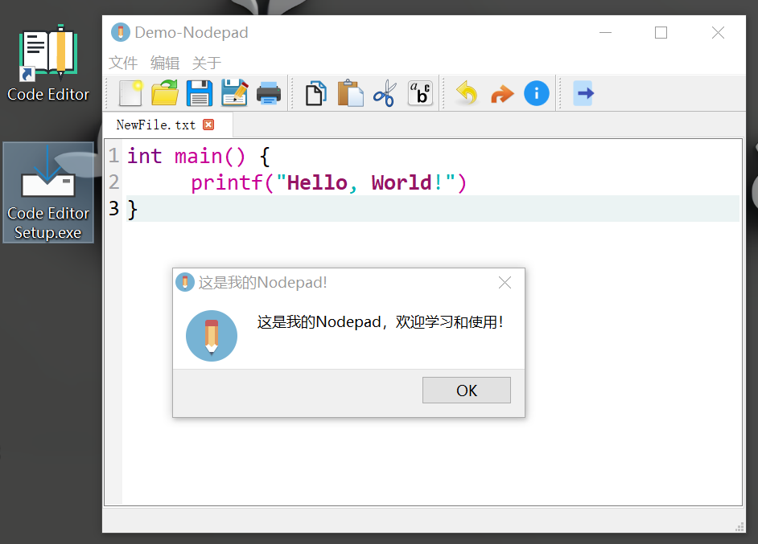

# 《用Qt开发Windows应用——Nodepad》代码笔记

本项目是基于续加仪大佬的《用QT开发Windows应用》系列课程，完成了代码编辑器Code Editor，从零开始使用QtCreator和C++语言构建Windows应用。

## 运行环境

- [Qt V5.12.12](https://download.qt.io/archive/qt/5.12/5.12.12/)

## 学习资料

大家可以按照顺序学习，从零编写Nodepad和代码编辑器 

1. [Qt开发Windows——Notepad](https://www.bilibili.com/video/BV16Y4y1y7iE)
2. [Qt开发Windows——配置文件，以Notepad Demo为例](https://www.bilibili.com/video/BV1Kc411E7gj)
3. [Qt开发项目实战——代码编辑器Code Editor Demo](https://www.bilibili.com/video/BV16M4y167tB/)

## 项目资源

- [PNG图片转ICO图标](https://cdkm.com/cn/png-to-ico)
- [打包工具 innosetup V6.2.2](https://jrsoftware.org/isdl.php#stable)

## 运行结果展示

## 学习总结

&emsp;&emsp;本次学习使用Qt开发Windows应用程序，主要使用QtCreator和C++语言编写代码，完成了代码编辑器Code Editor，主要功能包括：
- 编辑器基本功能：新建文件、打开文件、保存文件、文件另存为、打印、复制、粘贴、剪切、撤回、取消撤回、退出
- 代码编辑器功能：代码高亮、关键字/保留字样式、
- 编辑器展示功能：多个标签页展示，标签页关闭
- 版本展示：关于

&emsp;&emsp;通过学习这个课程系列，熟悉使用QtCreator工具，接下来准备将该项目使用PyQt和Python语言进行项目实战，熟练使用Qt进行Windows应用程序开发。
